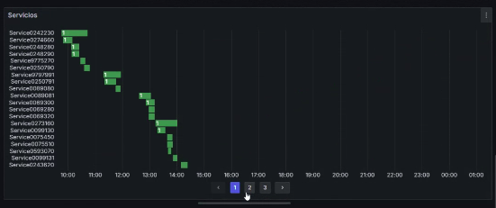

- [State timeline](#state-timeline)
  - [Pasos a realizar](#pasos-a-realizar)
    - [Notebook de JSONata](#notebook-de-jsonata)
    - [Grafana](#grafana)
      - [Consultas](#consultas)
      - [Transformaciones](#transformaciones)
      - [Configuración](#configuración)

# State timeline

Dado un JSON, `inputfile.json`, con el siguiente contenido:
```json
{
    {
     "services": [
          {
               "finishTime": "2024-01-15T01:25:52Z",
               "code": "0068",
               "role": "MANAGER",
               "startTime": "2024-01-15T00:16:52Z",
               "employees": 10,
               "serviceTime": "PT1H9M"
          },
          {
               "finishTime": "2024-01-15T01:33:32Z",
               "code": "0038",
               "role": "RAMP_MANAGER",
               "startTime": "2024-01-15T00:22:32Z",
               "employees": 4,
               "serviceTime": "PT1H11M"
          },
          ...
}
```
se desea obtener un [state timeline](https://grafana.com/docs/grafana/latest/panels-visualizations/visualizations/state-timeline/) similar a éste:



## Pasos a realizar

### Notebook de [JSONata](https://jsonata.org)

Mediante un notebook de [JSONata](https://jsonata.org), la forma de construir un [state timeline](https://grafana.com/docs/grafana/latest/panels-visualizations/visualizations/state-timeline/) es como se indica a continuación.

1. Crear un notebook de [JSONata](https://jsonata.org), `notebook.jsonata-book`

1. Cargar el fichero JSON `inputfile.json` con los datos a analizar:
    ```
    $loadFile("inputfile.json")
    ```

2. Crear un array compuesto por un objeto por cada instante de tiempo. Dicho objeto contendrá: 
   * Una primera clave que será `timestamp`, indicando el instante de tiempo a analizar.
   * El resto de claves serán los servicios. Los valores asociados a los servicios serán:
     * `null` si el servicio no empieza en el instante de tiempo indicado por el `timestamp` del objeto. 
     * `NUMERO_DE_EMPLEADO` si el servicio empieza en el instante de tiempo indicado por el `timestamp` del objeto.

      ```shell
      $map(
         $reduce(services, function($acc, $v) {
           $append($acc, [$v.startTime, $v.finishTime])
         }, []),
         function($time) {
           $merge([
             {"timestamp": $time},
             $reduce(
               $sort(services, function($a, $b) { 
                 $toMillis($a.startTime) - $toMillis($b.startTime) 
               }),
               function($acc, $service) {
                 $append($acc, {
                   ("Service"&$service.code): 
                     $toMillis($time) >= $toMillis($service.startTime) and $toMillis($time) < $toMillis($service.finishTime) ? 
                     $service.employees :
                     null
                 })
               }, [])
           ])
         }
      )
      ```

       El resultado debe ser similar a éste:
       ```json
       [
         {
           "timestamp": "2024-06-09T07:46:00Z",
           "Service9276280": null,
           "Service0329110": null,
           ...
           "Service0274660": null,
           "Service0242230": 7
         },
         {
           "timestamp": "2024-06-09T08:43:00Z",
           "Service9276280": null,
           "Service0329110": null,
           ...
           "Service0250790": 4,
           "Service9775270": null,
           ...
         },
         ...
       ]
       ```

### Grafana

1. En [Grafana](https://grafana.com), añadir un [state timeline](https://grafana.com/docs/grafana/latest/panels-visualizations/visualizations/state-timeline/) al cuadro de mandos.

#### Consultas

1. En la pestaña `Query` añadir como `Fields` el código de [JSONata](https://jsonata.org) descrito en el primer paso. Además, para este campo hay que establecer los siguientes valores:
    * `JSONata` en el desplegable a la derecha del código.
    * `Type`: `Auto`
  
    Finalmente comprobar que en la vista de tabla `Table view` se muestran los datos tal como se describen en los puntos anteriores.

#### Transformaciones

1. En la pestaña `Transform data` añadir la transformación `Extract fields` con la siguiente configuración:
    * `Source`: `result0` (o el nombre del campo añadido en la pestaña `Query`).
    * `Format`: `Auto`
    * `Replace all fields`: marcado
    * `Keep time`: desmarcado

2. En la pestaña `Transform data` añadir la transformación `Convert field type` con la siguiente configuración:
    * `Field`: `timestamp` (o el nombre de la columna con el instante de tiempo en la tabla de resultados).
    * `as`: `Time`
    * `Input format`: dejar vacío

#### Configuración

1. En el caso de que el número de filas del [state timeline](https://grafana.com/docs/grafana/latest/panels-visualizations/visualizations/state-timeline/) sea excesivo e impida la correcta visualización de la información, se pueden paginar los resultados tal como se indica [aquí](https://grafana.com/docs/grafana/latest/panels-visualizations/visualizations/state-timeline/#page-size-enable-pagination).