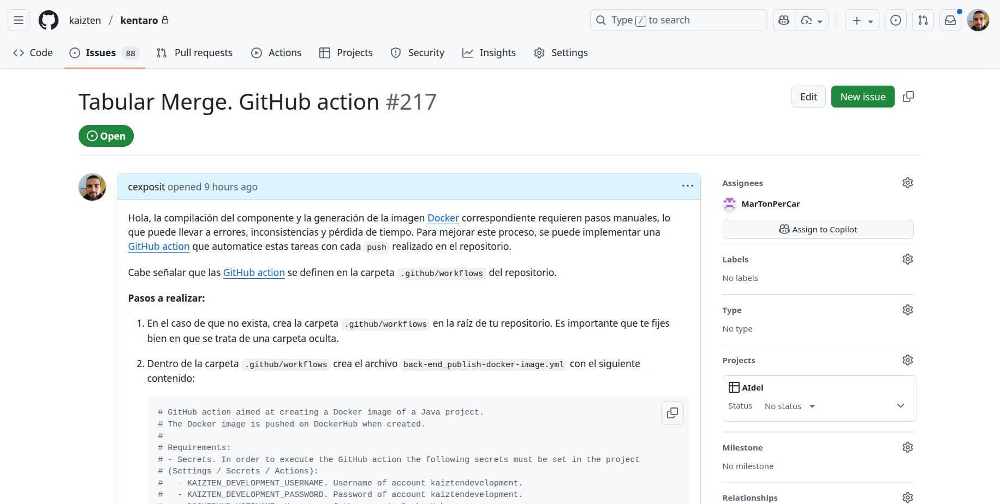

# Seguimiento de trabajo mediante GitHub issues

Durante las prácticas se te irán asignando **issues** en los repositorios a los que tienes acceso. A continuación puedes ver qué forma tienen y dónde puedes encontrarlos dentro de un repositorio (pestaña `Issues`):

Cada vez que se te asigne un issue, recibirás un **correo electrónico** con la información correspondiente. Es importante que:

1. **Leas con calma** la descripción del issue.  
2. Trates de **resolver lo que se expone en él**.  
3. Cuando tengas avances suficientes o hayas completado la tarea:  
   - **Sube siempre el código** al repositorio correspondiente.  
   - **Responde en el issue** indicando los avances realizados o la solución final.  

Ten en cuenta que la persona que creó el issue será quien:  
- Revise el código que subiste en el repositorio.  
- Te dé **feedback** sobre tu trabajo.  
- O, si lo considera oportuno, **cerrará el issue**.  

De esta manera, se asegura un flujo de trabajo ordenado y una comunicación clara sobre los avances en cada tarea.
