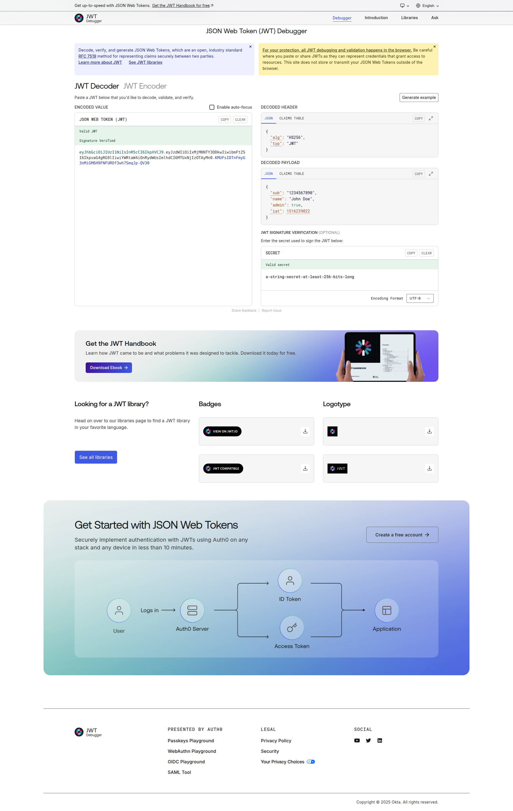
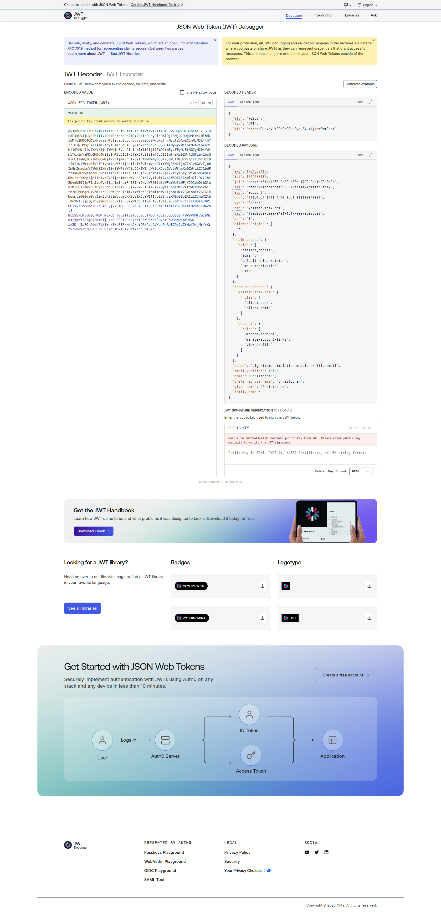

# JSON Web Token (JWT)

- [JSON Web Token (JWT)](#json-web-token-jwt)
  - [Overview](#overview)
  - [Obtaining a JSON Web Token](#obtaining-a-json-web-token)
    - [Example](#example)
  - [Decoding the JSON Web Token](#decoding-the-json-web-token)
  - [Using the obtained JSON Web Token](#using-the-obtained-json-web-token)
  - [Refresh JTW and expiration](#refresh-jtw-and-expiration)

## Overview

Kaizten Task uses [Keycloak](https://www.keycloak.org) (OpenID Connect) as the identity provider and accepts OAuth2 access tokens (JWT) for API authentication and authorization. Protected endpoints require a Bearer token in the Authorization header (Authorization: Bearer <access_token>). Tokens are issued by Keycloak and include standard claims (iss, aud, sub, exp, iat) plus realm- or client-specific claims that carry roles, scopes and other attributes used for authorization.

The backend validates incoming tokens by:
- verifying the JWT signature (using Keycloak's JWKS / well-known endpoint),
- checking issuer (iss) and audience (aud),
- enforcing token expiration (exp) and not-before (nbf) constraints,
- and evaluating roles/scopes from token claims for endpoint-level authorization.

Clients should obtain tokens from [Keycloak](https://www.keycloak.org) (token endpoint) and include them on each request. Access tokens are short-lived; applications should use refresh tokens or client-credentials flows as appropriate to maintain session continuity.

## Obtaining a JSON Web Token

A JSON Web Token (JWT) can be obtained as follows:
```shell
curl -X POST <KEYCLOAK_URL>:<KEYCLOAK_PORT>/realms/<REALM>/protocol/openid-connect/token \
	-H "Content-Type: application/x-www-form-urlencoded" \
	-d "grant_type=password&client_id=<CLIENT_ID>&username=<USERNAME>&password=<PASSWORD>"
```
In this case, the following elements must be replaced:
* `<KEYCLOAK_URL>`. URL of the Keycloak service.
* `<KEYCLOAK_PORT>`. Port of the Keycloak service.
* `<REALM>`. Realm of the application.
* `<CLIENT_ID>`. Identifier of the client.
* `<USERNAME>`. Username registered in Keycloak.
* `<PASSWORD>`. Password of the username registered in Keycloak.

### Example

Given the following elements:
* `<KEYCLOAK_URL>=localhost`
* `<KEYCLOAK_URL>=8083`
* `<REALM>=kaizten-task`
* `<CLIENT_ID>=kaizten-task-api`
* `<USERNAME>=christopher`
* `<PASSWORD>=1234`

a JWT can be obtained as follows:

```shell
curl -X POST http://localhost:8083/realms/kaizten-task/protocol/openid-connect/token \
  -H 'Content-Type: application/x-www-form-urlencoded' -d 'grant_type=password' \
  -d 'client_id=kaizten-task-api' -d 'username=christopher' -d 'password=1234'

{"access_token":"eyJhbGciOiJSUzI1NiIsInR5cCIgOiAiSldUIiwia2lkIiA6ICJwZHBvZHFQSnF4Y1Z1S1BFaFJkUVJjLVF2bi1TVl90NGprbndPd21GY2hZIn0.eyJleHAiOjE3NjQ1ODgzMTYsImlhdCI6MTc2NDU4ODAxNiwianRpIjoib25ydHJvOmM3MjBiYjZmLWU3YjYtNTBmZS02Mzk0LWJlZDAxZTEzYjE1MCIsImlzcyI6Imh0dHA6Ly9sb2NhbGhvc3Q6ODA4My9yZWFsbXMva2FpenRlbi10YXNrIiwiYXVkIjoiYWNjb3VudCIsInN1YiI6IjI1ZmQ2YmEyLTEyNzEtNGIyMC04YWJmLTgxZmYzMDg0MDg4NSIsInR5cCI6IkJlYXJlciIsImF6cCI6ImthaXp0ZW4tdGFzay1hcGkiLCJzaWQiOiI3MTM5N2Q0OC05ZDk1LTRkMjAtNGE1YS1iMjIwN2VhYjA1NWUiLCJhY3IiOiIxIiwiYWxsb3dlZC1vcmlnaW5zIjpbIioiXSwicmVhbG1fYWNjZXNzIjp7InJvbGVzIjpbIm9mZmxpbmVfYWNjZXNzIiwiYWRtaW4iLCJkZWZhdWx0LXJvbGVzLWthaXp0ZW4iLCJ1bWFfYXV0aG9yaXphdGlvbiIsInVzZXIiXX0sInJlc291cmNlX2FjY2VzcyI6eyJrYWl6dGVuLXRhc2stYXBpIjp7InJvbGVzIjpbImNsaWVudF91c2VyIiwiY2xpZW50X2FkbWluIl19LCJhY2NvdW50Ijp7InJvbGVzIjpbIm1hbmFnZS1hY2NvdW50IiwibWFuYWdlLWFjY291bnQtbGlua3MiLCJ2aWV3LXByb2ZpbGUiXX19LCJzY29wZSI6ImFsZ29yaXRobXMgc2ltdWxhdGlvbi1tb2RlbHMgcHJvZmlsZSBlbWFpbCIsImVtYWlsX3ZlcmlmaWVkIjpmYWxzZSwibmFtZSI6IkNocmlzdG9waGVyIiwicHJlZmVycmVkX3VzZXJuYW1lIjoiY2hyaXN0b3BoZXIiLCJnaXZlbl9uYW1lIjoiQ2hyaXN0b3BoZXIiLCJmYW1pbHlfbmFtZSI6IiJ9.Q2ivJ9tpHuT9ml6zAyIkD0zHNj0hnZtR3YTdDnMKxDSfuFhCuxX4of1ynGv-MRoA2wqD_0FIy7_JBPYngaGDLeE00lpHMNBZPUIGY61hMvykaUPURx5rFATK-8agU6VHwQ3VGt7g9MHnGmuf-q2W9tLcChZJXvAeVTAg7PVzH7yvFQkmICSJC0KyQ26We7YodE-zzN58-w9kX7aXDvMQIjD3Yichl30RLiBBU5FJkLek0EscGKhgQ9X7eve0JH1uo7hZUhA3NKLygTKJdmVgrBjZt3M7rAktBW4b6QrJ1laFxXSl1aqiXKuC0VYJMmKzd6Wh4Us_ZgvrSvngZx-kWg","expires_in":300,"refresh_expires_in":1800,"refresh_token":"eyJhbGciOiJIUzUxMiIsInR5cCIgOiAiSldUIiwia2lkIiA6ICJiNjk3YWJiMi0yOTRkLTQ1N2EtODE3My03NTdkOWY0OThhYzMifQ.eyJleHAiOjE3NjQ1ODk4MTYsImlhdCI6MTc2NDU4ODAxNiwianRpIjoiMTA0YmNjYWQtMDI5ZC02MDBhLWUyMmQtZGQ0ODIyYWFlNThiIiwiaXNzIjoiaHR0cDovL2xvY2FsaG9zdDo4MDgzL3JlYWxtcy9rYWl6dGVuLXRhc2siLCJhdWQiOiJodHRwOi8vbG9jYWxob3N0OjgwODMvcmVhbG1zL2thaXp0ZW4tdGFzayIsInN1YiI6IjI1ZmQ2YmEyLTEyNzEtNGIyMC04YWJmLTgxZmYzMDg0MDg4NSIsInR5cCI6IlJlZnJlc2giLCJhenAiOiJrYWl6dGVuLXRhc2stYXBpIiwic2lkIjoiNzEzOTdkNDgtOWQ5NS00ZDIwLTRhNWEtYjIyMDdlYWIwNTVlIiwic2NvcGUiOiJiYXNpYyB3ZWItb3JpZ2lucyBhbGdvcml0aG1zIHNpbXVsYXRpb24tbW9kZWxzIHJvbGVzIGFjciBwcm9maWxlIGVtYWlsIn0.R6raZZDLyfLZrahHKC2PTQ89H8pma1Bt_PWJy48sB3FLl1gjQyzom1Cpo3RQuvOH27utbWQpAYJRH5BpM5xEyw","token_type":"Bearer","not-before-policy":0,"session_state":"71397d48-9d95-4d20-4a5a-b2207eab055e","scope":"algorithms simulation-models profile email"}
```

For convenience, the JWT can be stored in an environment variable to be used in the subsequent requests to the REST API, as follows:
```shell
KAIZTENTASKTOKEN=$(curl -X POST http://localhost:8083/realms/kaizten-task/protocol/openid-connect/token -H 'Content-Type: application/x-www-form-urlencoded' -d 'grant_type=password' -d 'client_id=kaizten-task-api' -d 'username=christopher' -d 'password=1234' | jq -r .access_token)
```

The content of the JWT can be printed, as follows:
```shell
eyJhbGciOiJSUzI1NiIsInR5cCIgOiAiSldUIiwia2lkIiA6ICJwZHBvZHFQSnF4Y1Z1S1BFaFJkUVJjLVF2bi1TVl90NGprbndPd21GY2hZIn0.eyJleHAiOjE3NjQ1ODg0MTcsImlhdCI6MTc2NDU4ODExNywianRpIjoib25ydHJvOjBmZDQ0MjUwLThjMzgtZDAwZC1mNzM5LTlhY2ZlOTNlMDQ5YiIsImlzcyI6Imh0dHA6Ly9sb2NhbGhvc3Q6ODA4My9yZWFsbXMva2FpenRlbi10YXNrIiwiYXVkIjoiYWNjb3VudCIsInN1YiI6IjI1ZmQ2YmEyLTEyNzEtNGIyMC04YWJmLTgxZmYzMDg0MDg4NSIsInR5cCI6IkJlYXJlciIsImF6cCI6ImthaXp0ZW4tdGFzay1hcGkiLCJzaWQiOiJmOGUwMjA2ZS1jMmVhLTk0YTEtMWNmNy05OTk3OWJlMzU2YTgiLCJhY3IiOiIxIiwiYWxsb3dlZC1vcmlnaW5zIjpbIioiXSwicmVhbG1fYWNjZXNzIjp7InJvbGVzIjpbIm9mZmxpbmVfYWNjZXNzIiwiYWRtaW4iLCJkZWZhdWx0LXJvbGVzLWthaXp0ZW4iLCJ1bWFfYXV0aG9yaXphdGlvbiIsInVzZXIiXX0sInJlc291cmNlX2FjY2VzcyI6eyJrYWl6dGVuLXRhc2stYXBpIjp7InJvbGVzIjpbImNsaWVudF91c2VyIiwiY2xpZW50X2FkbWluIl19LCJhY2NvdW50Ijp7InJvbGVzIjpbIm1hbmFnZS1hY2NvdW50IiwibWFuYWdlLWFjY291bnQtbGlua3MiLCJ2aWV3LXByb2ZpbGUiXX19LCJzY29wZSI6ImFsZ29yaXRobXMgc2ltdWxhdGlvbi1tb2RlbHMgcHJvZmlsZSBlbWFpbCIsImVtYWlsX3ZlcmlmaWVkIjpmYWxzZSwibmFtZSI6IkNocmlzdG9waGVyIiwicHJlZmVycmVkX3VzZXJuYW1lIjoiY2hyaXN0b3BoZXIiLCJnaXZlbl9uYW1lIjoiQ2hyaXN0b3BoZXIiLCJmYW1pbHlfbmFtZSI6IiJ9.Sof3K7EIxzL0SE4J0P1OU1xyIFh88aelBlnE46EyjVkuiMu8OCGVXu4ELtA9JsZHNYEttXtsV6L9sV4tOvst1C0A2al4-Bc5SbkLNtuBsUnRBW_NdxpDnl0Ez1TJ2fgD69uJIMGBhkbqI73dbUSdp_lWPyPWHF7pI6Nco42jqn5iFIgOJEKYb1j_kqbPFQG1nRcE7cKf9ZWUSKeh8DvsIJ5wQdpPLpfDPwZ-av2Drc3aFOrAdwb7lNiYnx8XcRERxNwoCNdYORkAqdAVXqaPqRdEG9y2dZtHufQ4_MrYrKctv2umgVItrOCd_Llv5HcXoPTM-zCzxCWtxoghFMIUYg
```
## Decoding the JSON Web Token

The JWT can be decoded by using [this website](https://www.jwt.io):



The JWT must be pasted in the textarea found in the left column:



The right column shows the content of the JWT once decoded. It contains fields indicating roles, preferred username, etc. This information is used to guarantee authentication and authorization.

## Using the obtained JSON Web Token

Once a JWT has been obtained, it must be used in each request to the REST API of Kaizten Task. That is, include the token in requests as a Bearer token in the `Authorization` header:

```shell
curl <HTTP_VERB> <KAIZTEN_TASK_URL>:<KAIZTEN_TASK_PORT>/v1/<ENDPOINT> \
	-H "Authorization: Bearer <JWT>" \
	<OPTIONAL_BODY>"
```

In this case, the following elements must be replaced:
* `<HTTP_VERB>` HTTP verb used in the request (`GET`, `POST`, `PUT`, etc.)
* `<KAIZTEN_TASK_URL>`. URL of Kaizten Task REST API.
* `<KAIZTEN_TASK_PORT>`. Port of Kaizten Task REST API.
* `<ENDPOINT>`. Endpoint of the REST API to request to.
* `<JWT>`. JSON Web Token obtained through the Keycloak service.
* <OPTIONAL_BODY>. Optional body of the request. It could appear in POST or PUT requests.

The REST API documentation must be review to known how make requests.

## Refresh JTW and expiration

Access tokens (JWT) are short-lived. Use the returned `refresh_token` with the token endpoint to obtain a new access token (password grant flow) or request a new client-credentials token in automated clients. Respect `expires_in` to avoid rejected requests.