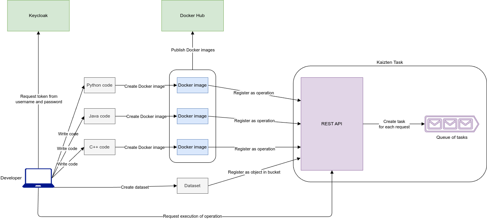

# Register and execute operations

- [Register and execute operations](#register-and-execute-operations)
  - [Write source code](#write-source-code)
  - [Create Docker image](#create-docker-image)
  - [Obtain JWT](#obtain-jwt)
  - [Configure the example](#configure-the-example)
  - [Register operation](#register-operation)
  - [Register datasets](#register-datasets)
  - [Request execution of operation](#request-execution-of-operation)
  - [Enqueue of task](#enqueue-of-task)
  - [Execution of task](#execution-of-task)
  - [Check task status](#check-task-status)
  - [Additional steps](#additional-steps)

High-level architecture diagram showing clients, Keycloak (auth), the Kaizten Task API/execution engine, MinIO (artifacts) and MongoDB (metadata), with the main data and notification flows.



The commands below provide an end-to-end example using the `dijkstra` image. They require `curl` and `jq`.

## Write source code

The developer writes source code in their favourite programming language.

The example uses the `dijkstra` repository from the organisation. Its container must accept the graph URI as a named argument so that Kaizten Task can construct the command line:

```shell
docker run --rm dijkstra --graph <GRAPH_URI> --source A
```

Kaizten Task currently supports named operation parameters (`-x` and `--option`), not positional parameters. Therefore, the container entry point must expose `--graph URI` instead of requiring `GRAPH_URI` as a positional argument. The `--source` argument retains the interface described in the `dijkstra` repository. The current `dijkstra` image must be rebuilt with this interface before the example can complete successfully; otherwise, the task finishes with `dijkstra.py: error: unrecognized arguments: --graph`.

## Create Docker image

The code is packaged into a container image using Docker. The image can optionally be published to a container registry so the Kaizten Task engine can pull and run it.

For this example, build or pull the image as `dijkstra` on the Docker host used by Kaizten Task. Verify that it is available with:

```shell
docker run --rm dijkstra --help
```

The displayed usage must include `--graph GRAPH_URI`. If it lists `graph_uri` under positional arguments, the image is not yet compatible with Kaizten Task.

If the image is stored in the organisation's container registry, replace `dijkstra` in the examples with its fully qualified image name.

## Obtain JWT

The developer obtains an access token from Keycloak by authenticating with their username and password. The returned access token must be included in subsequent API requests as a Bearer token in the `Authorization` header. See [JSON Web Token (JWT)](jwt.md) for more details.

For the local environment, the token can be stored in `KAIZTENTASKTOKEN`:

```shell
KAIZTENTASKTOKEN=$(curl --silent --request POST \
  'http://localhost:8083/realms/kentaro/protocol/openid-connect/token' \
  --header 'Content-Type: application/x-www-form-urlencoded' \
  --data-urlencode 'grant_type=password' \
  --data-urlencode 'client_id=kaizten-task-api' \
  --data-urlencode 'username=christopher' \
  --data-urlencode 'password=1234' \
  | jq --raw-output '.access_token')
```

## Configure the example

Define the API URL and the names used by the example:

```shell
KAIZTEN_TASK_URL='http://localhost:8080'
OPERATION_NAME='dijkstra'
FOLDER_NAME='dijkstra-datasets'
```

The following graph, saved as `graph.json`, is compatible with the `dijkstra` repository:

```json
{
  "A": {"B": 4, "C": 2},
  "B": {"C": 5, "D": 10},
  "C": {"B": 1, "D": 8},
  "D": {},
  "E": {}
}
```

## Register operation

Register the operation with `POST /v1/operations`. The `--graph` parameter is a `DATASET`, while `--source` is a string:

```shell
curl --fail-with-body --request POST \
  "$KAIZTEN_TASK_URL/v1/operations" \
  --header "Authorization: Bearer $KAIZTENTASKTOKEN" \
  --header 'Content-Type: application/json' \
  --data "{
    \"name\": \"$OPERATION_NAME\",
    \"description\": \"Computes shortest paths in a directed weighted graph\",
    \"dockerImage\": \"dijkstra\",
    \"params\": [
      {\"name\": \"--graph\", \"type\": \"DATASET\", \"required\": true},
      {\"name\": \"--source\", \"type\": \"STRING\", \"required\": true}
    ],
    \"labels\": [\"graph\", \"shortest-path\"]
  }" | jq
```

Creating operations requires an account with the administrator role.

## Register datasets

Datasets are uploaded into a folder. First create the folder with `POST /v1/datasets/folders`:

```shell
curl --fail-with-body --request POST \
  "$KAIZTEN_TASK_URL/v1/datasets/folders" \
  --header "Authorization: Bearer $KAIZTENTASKTOKEN" \
  --header 'Content-Type: application/json' \
  --data "{\"name\": \"$FOLDER_NAME\"}" | jq
```

Then upload `graph.json` as a multipart dataset with `POST /v1/datasets/dataset/{folderName}`. Save the returned dataset UUID for the execution request:

```shell
DATASET_ID=$(curl --fail-with-body --silent --request POST \
  "$KAIZTEN_TASK_URL/v1/datasets/dataset/$FOLDER_NAME" \
  --header "Authorization: Bearer $KAIZTENTASKTOKEN" \
  --form 'request={"name":"dijkstra-graph","labels":["graph","dijkstra"],"description":"Example directed weighted graph"};type=application/json' \
  --form 'file=@graph.json;type=application/json' \
  | jq --raw-output '.id')

printf '%s\n' "$DATASET_ID"
```

The UUID identifies the dataset metadata. At execution time, Kaizten Task resolves it to the dataset URI passed to the container as the value of `--graph`.

## Request execution of operation

Execute the registered operation with `POST /v1/operations/{operationName}`. Dataset values are sent through `entityParameters`; ordinary command-line values are sent through `params`:

```shell
TASK_ID=$(curl --fail-with-body --silent --request POST \
  "$KAIZTEN_TASK_URL/v1/operations/$OPERATION_NAME" \
  --header "Authorization: Bearer $KAIZTENTASKTOKEN" \
  --header 'Content-Type: application/json' \
  --data "{
    \"name\": \"dijkstra-from-a\",
    \"timeout\": 300000,
    \"params\": [
      {\"name\": \"--source\", \"type\": \"STRING\", \"value\": \"A\"}
    ],
    \"entityParameters\": [
      {\"name\": \"--graph\", \"value\": \"$DATASET_ID\"}
    ]
  }" \
  | jq --raw-output '.id')

printf '%s\n' "$TASK_ID"
```

The API returns HTTP `202 Accepted` and the created task. The example stores its `id` in `TASK_ID` for later queries.

## Enqueue of task

The execution engine schedules the run, pulls the Docker image if required, creates a container with the configured environment and queues the execution. No additional client request is needed.

## Execution of task

When computational resources are available, the first task in the queue is executed. Standard output, error streams and output artifacts are captured. Upon completion, Kaizten Task updates the task to a terminal status such as `COMPLETED`, `COMPLETED_ERRORS` or `COMPLETED_TIMEOUT`, and optionally sends a result summary to the supplied `responseURL`.

For this example, the generated container arguments are equivalent to:

```shell
docker run --rm dijkstra --graph <DATASET_URI> --source A
```

## Check task status

Poll the task with `GET /v1/tasks/{id}`:

```shell
curl --fail-with-body --request GET \
  "$KAIZTEN_TASK_URL/v1/tasks/$TASK_ID" \
  --header "Authorization: Bearer $KAIZTENTASKTOKEN" \
  --header 'Accept: application/json' | jq
```

The response contains fields such as `status`, `exitCode`, `startingTime`, `finishingTime`, `outputData` and `outputError`. The `outputData` and `outputError` values are dataset UUIDs whose contents can be downloaded with `GET /v1/datasets/{id}/content`. Repeat the request until `status` reaches a terminal state. Clients can alternatively supply `responseURL` in the execution body to receive a notification. via a webhook POST when it is finished.

## Additional steps

Get the task created by the execution request:

```shell
curl --fail-with-body --request GET \
  "$KAIZTEN_TASK_URL/v1/tasks/$TASK_ID" \
  --header "Authorization: Bearer $KAIZTENTASKTOKEN" \
  --header 'Accept: application/json' | jq
```

Get the metadata of the input dataset. `--graph` is the command-line argument name, while `DATASET` is its Kaizten Task parameter type. The execution request supplies the dataset UUID and Kaizten Task resolves it to the URI passed to the container:

```shell
curl --fail-with-body --request GET \
  "$KAIZTEN_TASK_URL/v1/datasets/$DATASET_ID" \
  --header "Authorization: Bearer $KAIZTENTASKTOKEN" \
  --header 'Accept: application/json' | jq
```

Download the content of the input dataset:

```shell
curl --fail-with-body --request GET \
  "$KAIZTEN_TASK_URL/v1/datasets/$DATASET_ID/content" \
  --header "Authorization: Bearer $KAIZTENTASKTOKEN" \
  --output downloaded-graph.json
```

List the tasks:

```shell
curl --fail-with-body --request GET \
  "$KAIZTEN_TASK_URL/v1/tasks" \
  --header "Authorization: Bearer $KAIZTENTASKTOKEN" \
  --header 'Accept: application/json' | jq
```

List the datasets:

```shell
curl --fail-with-body --request GET \
  "$KAIZTEN_TASK_URL/v1/datasets" \
  --header "Authorization: Bearer $KAIZTENTASKTOKEN" \
  --header 'Accept: application/json' | jq
```
